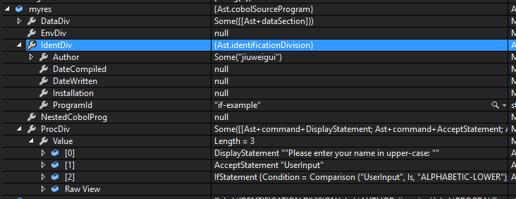

# F# FsLexYacc #

Complete (with Main) example from here: http://realfiction.net/2014/10/20/Lexing-and-parsing-in-F/

- lexer.fsl - lexer. Build action: *FsLex*.
- parser.fsy -parser. Build action: *FsYacc*.
- ast.fs - syntax tree.

## Include files ##

- parser.fs, lexer.fs - generated by FsLexYacc and must be compiled. Build action must be set to *Compile*. Make empty at start, just to set actions.

## Code for example##

(must use triple quotes for escape):
 
	IDENTIFICATION DIVISION.
	AUTHOR. jiuweigui.
	PROGRAM-ID. if-example.
	DATA DIVISION.
	WORKING-STORAGE SECTION.
	01 UserInput PIC X(20).
	PROCEDURE DIVISION.
	DISPLAY "Please enter your name in upper-case: ".
	ACCEPT UserInput.
	IF UserInput IS ALPHABETIC-LOWER
		DISPLAY "Plz uppercase. Fixed it, ", UserInput
	END-IF
	STOP RUN.

## AST result in code ##

## Notes ##

Inside fsproj-file:

    <Import Project="$(FSharpTargetsPath)" />
    <ItemGroup>
        <Compile Include="AssemblyInfo.fs" />
        <Compile Include="Ast.fs" />
        <Compile Include="parser.fs" />
        <Compile Include="lexer.fs" />
        <FsLex Include="lexer.fsl">
          <OtherFlags>--unicode</OtherFlags>
        </FsLex>
        <FsYacc Include="parser.fsy">
          <OtherFlags>--module TheParser</OtherFlags>
        </FsYacc>	
        <Compile Include="Program.fs" />
        <None Include="App.config" />
        <Content Include="packages.config" />
    </ItemGroup>
